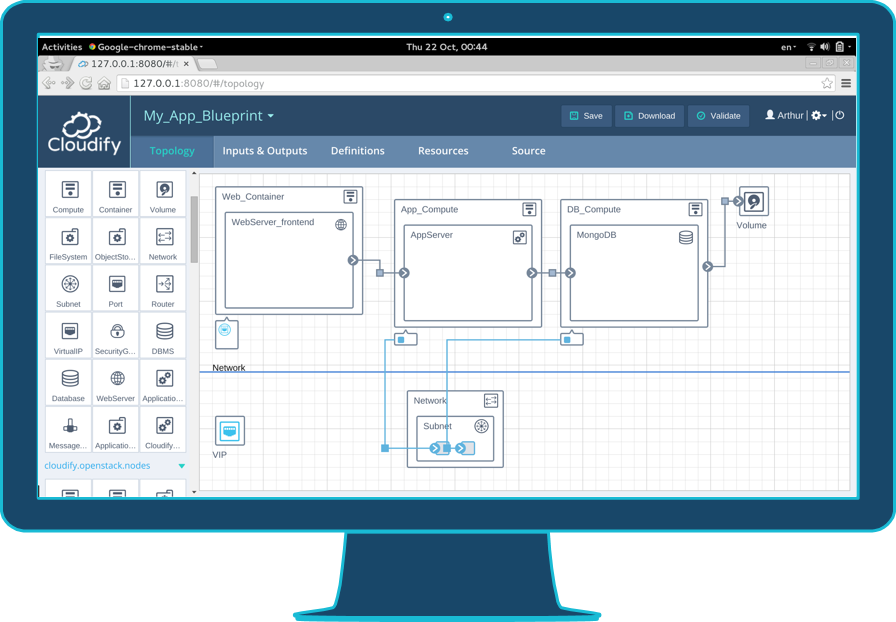

# Introduction to Cloudify

## WHAT IS CLOUDIFY?

Cloudify is an open-source framework that allows you to automate both orchestration and maintenance of an application in the cloud. Via official and community-contributed plugins, Cloudify supports a number of platforms and services that can be leveraged to deploy applications.

## WHERE DOES IT FIT?

When deploying to the cloud, in addition to considering your own code, you have to deal with an unending list of requirements, such as infrastructure (AWS, OpenStack), configuration management (Ansible, Puppet), log monitoring (Collectd, Elasticsearch), and continuous integration (Travis, Jenkins). Difficult to implement, difficult to maintain... and nearly impossible to replicate in a different environment.

This is where Cloudify comes in: by writing a single blueprint (in TOSCA, of course!), you can automate the deployment and maintenance of all required resources, regardless of the underlying infrastructure.

You can see where Cloudify fits in the following diagram; it is the green Orchestration box (the TOSCA blueprint is represented by a blue scroll):

## ORCHESTRATION

How does Cloudify handle orchestration?

You start by writing a blueprint, using TOSCA and YAML, that describes your application in its entirety. This includes, but is not limited to: what infrastructure it'll run on, application code, scripts, monitoring and logging requirements, and last but not least, the topology: on what VMs each of the above will run and how they relate to one another. The following should give you an idea of how Cloudify represents a topology diagram:

When you give Cloudify such a blueprint, it'll be able to manifest your application automatically. It'll not only configure networks and firewalls, launch compute instances, set up configuration management, and actually deploy the app, but Cloudify will do its best to keep it that way - say, if one of the VMs dies.

## MAINTENANCE

Cloudify's workflows (more on them later) allow you to change your application's structure, deploy code to your servers, scale or even heal or your system - manually or automatically.

Cloudify uses metrics and log collectors to stream the necessary information to an easily accessible central instance, so that you'll be able to comfortably monitor your system. Data aggregation and visualization help you make tactical decisions, such as when to scale or heal a deployment, or strategic ones based on analysis of application behavior.

For instance, you could configure Cloudify to scale a deployment automatically based on:
  - Metrics from the application or servers
  - Specific log messages
  - The number of instances currently deployed
  - Script output from a specific server
  - ...or pretty much any other parameter

## PLUGINS

Plugins are Cloudify's workhorses. A plugin is simply an abstraction layer (written in Python), with which pretty much any tool or service can be installed, configured or used by the system. Take the Script Plugin, for example: it allows Cloudify to execute arbitrary scripts at different times in the application's lifecycle - upon creation, after completion of configuration, and so on.

Notably, plugins can also be used to extend the cloud platforms supported by Cloudify. There are officially maintained plugins for AWS and OpenStack, for example, but also a community-contributed one for CloudStack. The same applies to configuration management: you can use Puppet, Chef, and Salt out of the box, or Ansible via a contributed plugin.